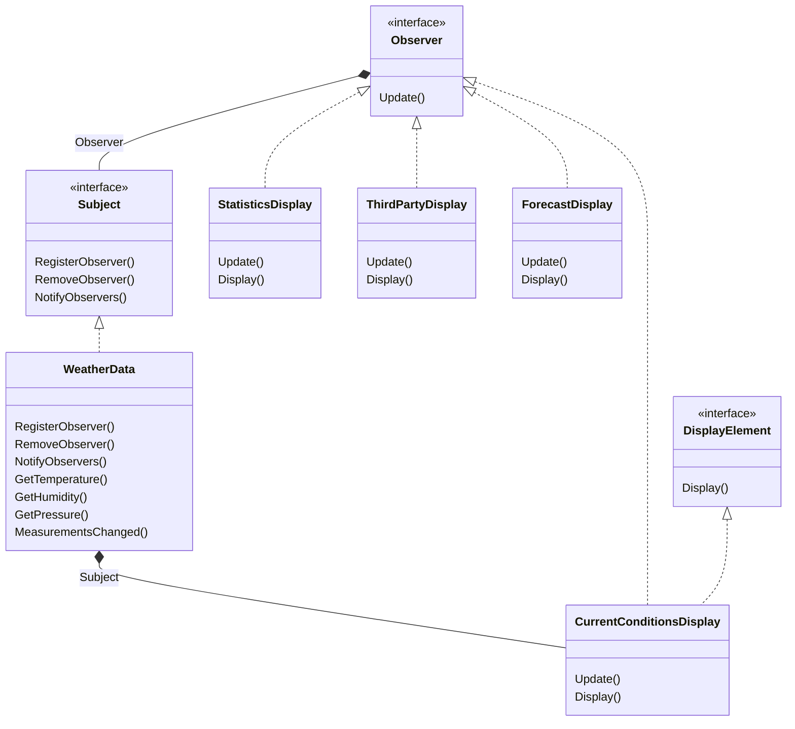

# Obverver Pattern
The observer pattern defines a one-to-many dependency between objects so that when one object changes state,
all its dependents are notified and updated.

## OO Principles
- Strive for loosely coupled designs between objects that interact.

 

Note*  Similar to the book, all displays should have a pointer to the class 'WeatherData' & the interface 'DisplayElement'
